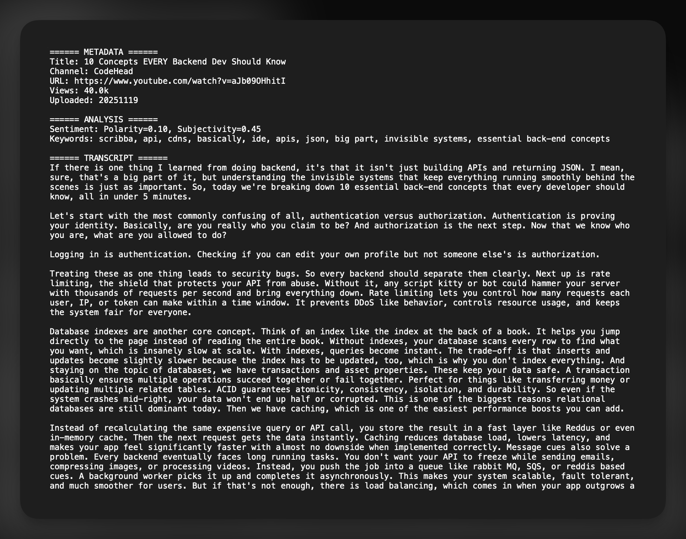
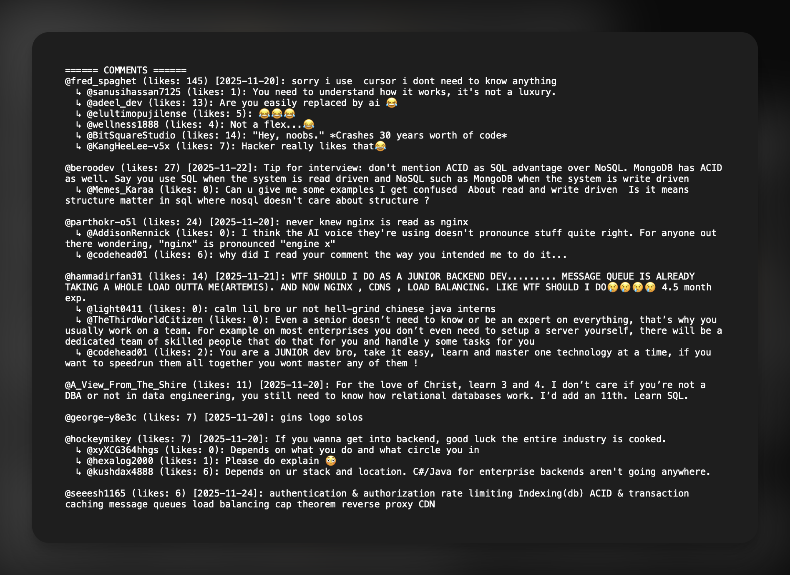

# YouTube Harvester 🎬


(First open-source project 🤞🏻)

I built this scrappy little Python tool to do the grunt work. It pulls YouTube videos apart and hands you the **good stuff** — transcripts, comments, metadata — in clean, readable files. 😌

## What It Does 🔧

- 📺 **Metadata** — video title, channel, views, upload date, tags
- 📜 **Transcript** — official or auto-captions, stripped of timecodes
- 💬 **Comments** — top-liked, threaded with replies
- 🧠 **Analysis** — sentiment scores & keyword extraction
- 📁 **Formats** — save as `.txt`, `.json`, or `.csv` (flat comments for Sheets/Pandas)
- ⚡ **Comments-Only Mode** — skip metadata/transcript for 5-10x faster harvesting
- ✨ **Clean Output** — like counts (e.g., `1.3M`), proper dates, nested replies
- 🌀 **Progress Bar** — detailed step-by-step progress & parallel bulk processing

<p align=center>


</p>

---

## Install Me 🛠️

### Step 1: Clone the Repo

```bash
git clone https://github.com/wheevu/yt-harvester.git
cd yt-harvester
```

### Option 1: Install as CLI Tool (Recommended)

```bash
pip install -e .
yt-harvester "https://www.youtube.com/watch?v=dQw4w9WgXcQ"
```

### Option 2: Run Directly

```bash
pip install -r requirements.txt
python yt_harvester.py "https://www.youtube.com/watch?v=dQw4w9WgXcQ"
```

---

## Use Me 🧠

### Basic (Single Video)

```bash
yt-harvester https://youtube.com/watch?v=dQw4w9WgXcQ
yt-harvester dQw4w9WgXcQ  # just the ID works too
```

### Bulk Processing (Multiple Videos)

Process multiple videos from a file:

```bash
yt-harvester --bulk links.txt
```

Create a text file with one YouTube URL per line:

```
# links.txt
https://www.youtube.com/watch?v=ZncbtRo7RXs
https://www.youtube.com/watch?v=Q3K0TOvTOno
https://youtu.be/g2X2LdJAIpU
# Lines starting with # are ignored
```

Save outputs to a specific directory:

```bash
yt-harvester --bulk links.txt --bulk-output-dir ./outputs
yt-harvester --bulk links.txt -f json --bulk-output-dir ./results -c 30
```

### Options

```bash
-c 10               # Grab 10 top comments only
-f json             # Save as JSON instead of TXT
-f csv              # Flat CSV for Google Sheets / Pandas
-o my_file.txt      # Custom output filename (single video only)
--max-comments 20000  # Pull deeper into the comment pit
--bulk FILE         # Process multiple videos from file
--bulk-output-dir DIR  # Output directory for bulk mode
--comment-sort newest  # Chronological order (default: top)
--comments-only     # Skip metadata/transcript/analysis (fast mode)
```

Combine as needed:

```bash
# Single video
yt-harvester dQw4w9WgXcQ -c 5 -f json -o output.json

# Bulk processing
yt-harvester --bulk my_videos.txt -c 15 -f json --bulk-output-dir ./downloads
```

### Fast Dataset Building

For building large comment datasets quickly:

```bash
# Fastest: comments-only + newest sort + CSV output
yt-harvester VIDEO_URL --comments-only --comment-sort newest -f csv -c 100

# Bulk harvest for dataset building
yt-harvester --bulk links.txt --comments-only --comment-sort newest -f csv --max-comments 5000
```

### Full CLI Reference

```
positional:
  url                  YouTube video URL or video ID (not used with --bulk)

options:
  -h, --help           Show help
  -c N, --comments N   Top N comments (default: 20)
  -f {txt,json,csv}    Format (default: txt)
  --max-comments N     Cap total comments/replies (default: 10000)
  -o FILE              Custom filename (single video only)
  --bulk FILE          Process multiple videos from file (one URL per line)
  --bulk-output-dir DIR  Output directory for bulk mode
  --comment-sort {top,newest}  Sort by likes or chronological (default: top)
  --comments-only      Skip metadata/transcript/analysis for speed
```

---

## Output Samples 🧾

### Text

```
====== METADATA ======
Title: ...
Channel: ...
URL: ...

====== TRANSCRIPT ======
...

====== COMMENTS ======
@user (likes: 2.2M) [2022-07-22]: This video changed my life
  ↳ @replier (likes: 2k): Same here 💯
```

### JSON

```json
{
  "metadata": {...},
  "transcript": ["..."],
  "comments": [
    {
      "author": "@...",
      "text": "...",
      "like_count": 12345,
      "replies": [...]
    }
  ]
}
```

### CSV (Flat Comments)

```csv
comment_id,video_id,comment_text,like_count,is_reply,parent_comment_id
Ugw123...,dQw4w9WgXcQ,This video changed my life,22000,false,
Ugw456...,dQw4w9WgXcQ,Same here 💯,2000,true,Ugw123...
```

---

## How Comments Are Sorted 🔍

- 🧠 **`--comment-sort top`** (default) — Top N root comments by likes
- 🕐 **`--comment-sort newest`** — Chronological order, unbiased sample
- 🪆 Replies under each root, newest first (up to 50 per root)

---

## Requirements 📦

- Python 3.8+
- [`yt-dlp`](https://github.com/yt-dlp/yt-dlp)
- [`youtube-transcript-api`](https://github.com/jdepoix/youtube-transcript-api)
- `tqdm` (for progress bars)
- `textblob` (for sentiment analysis)
- `pyyaml` (for config)

---

## Dev Mode 👨🏻‍💻

```bash
git clone https://github.com/wheevu/yt-harvester.git
cd yt-harvester
pip install -e .
# Hack on: src/yt_harvester/__main__.py
```

### Structure

```
yt_harvester/
├── pyproject.toml
├── requirements.txt
└── src/
    └── yt_harvester/
        ├── __init__.py
        ├── __main__.py
        ├── cli.py
        ├── config.py
        ├── downloader.py
        ├── processor.py
        └── utils.py
```

---

## Common Errors & Fixes 😮‍💨

- `ModuleNotFoundError: yt_dlp`

```bash
pip install yt-dlp
```

- `ModuleNotFoundError: youtube_transcript_api`

```bash
pip install youtube-transcript-api
```

- `command not found: yt-harvester`

```bash
pip install -e .
# Make sure your scripts dir is in PATH
```
