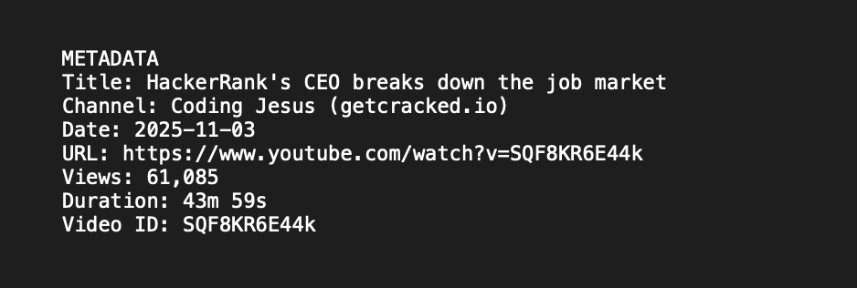
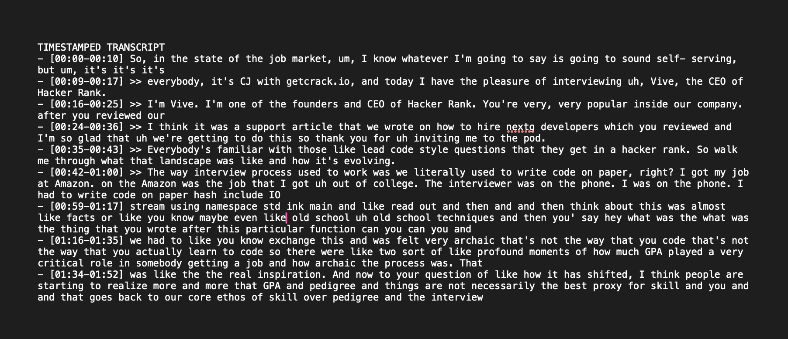
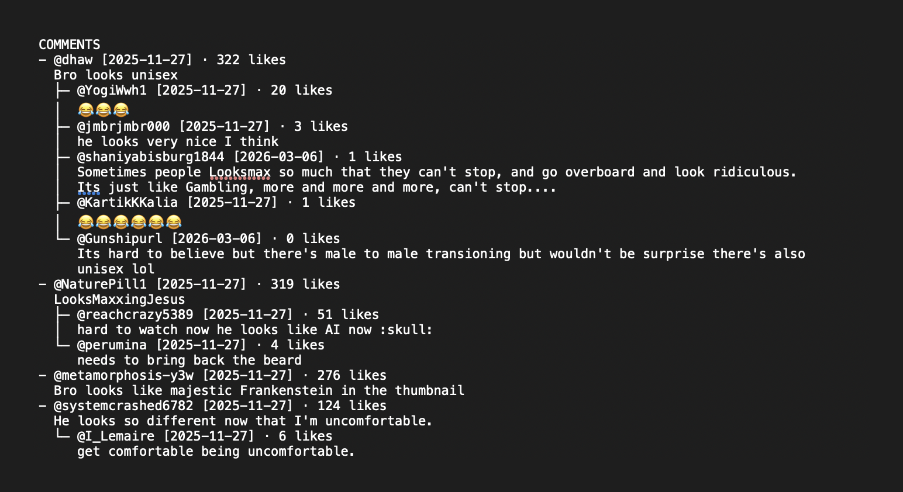

# YouTube Harvester

A CLI tool that extracts metadata, timestamped transcript and threaded comments. *Previously written in Python.*

## Format

<p align="center">
  
</p>

<p align="center">
  
</p>

<p align="center">
  
</p>

Current comment caps:
- up to `4000` total extracted comments
- up to `300` root comments
- up to `12` replies per retained thread


## Install

```bash
brew install yt-dlp
go build
```

Or install directly with Go:

```bash
go install github.com/wheevu/yt-harvester@latest
```
markdown.showPreviewToSidemarkdown.showPreviewToSide
`yt-dlp` must be available on your `PATH`.

## Usage

```bash
yt-harvester https://www.youtube.com/watch?v=dQw4w9WgXcQ
yt-harvester dQw4w9WgXcQ
```

Optional output path:

```bash
yt-harvester dQw4w9WgXcQ -o report.txt
```

If `-o` is omitted, output defaults to:

```text
output/<video title> [<video_id>].txt
```

## Transcript selection order

The tool is yt-dlp-centric. It looks for available subtitle tracks, then chooses:
1. manual English subtitles if available
2. automatic English captions if no manual English track exists

If no transcript is available, the report renders `(Transcript unavailable.)`