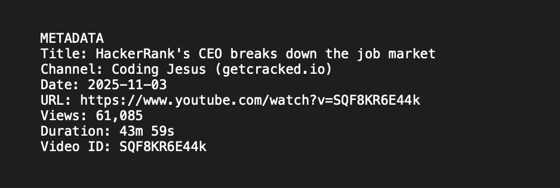
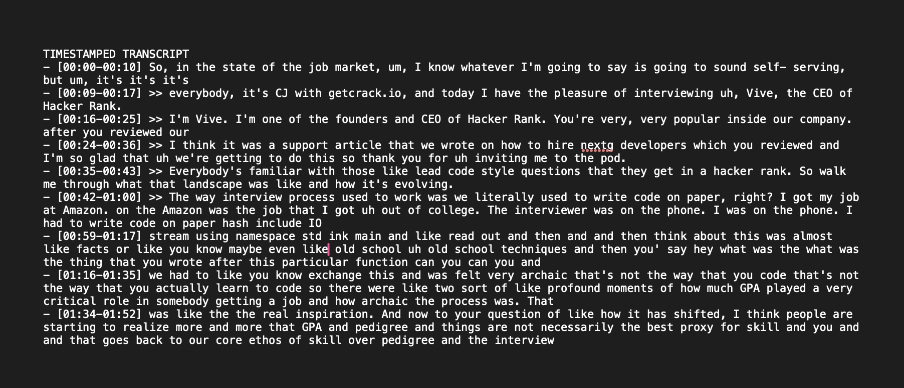
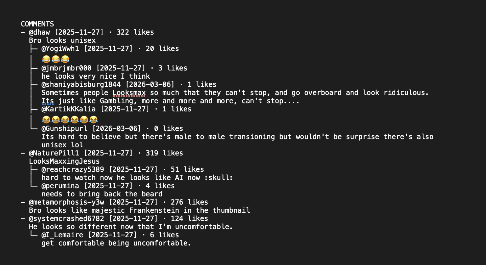

# YouTube Harvester

A small Go CLI that turns a YouTube video into one readable text report.

  

The report keeps video metadata, a timestamped transcript, root comments, and their replies together.

<table>
  <tr>
    <td></td>
    <td></td>
  </tr>
</table>

Manual English subtitles come first.
Automatic English captions are the fallback.
If neither exists, the report says so plainly.

[Install, run, and inspect the extraction limits](GUIDE.md).
